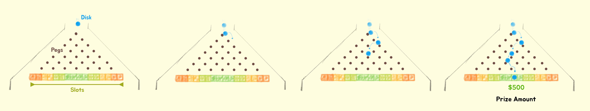
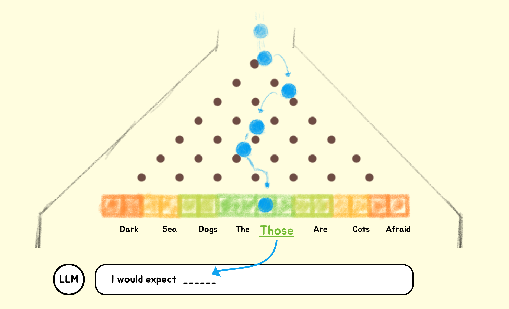
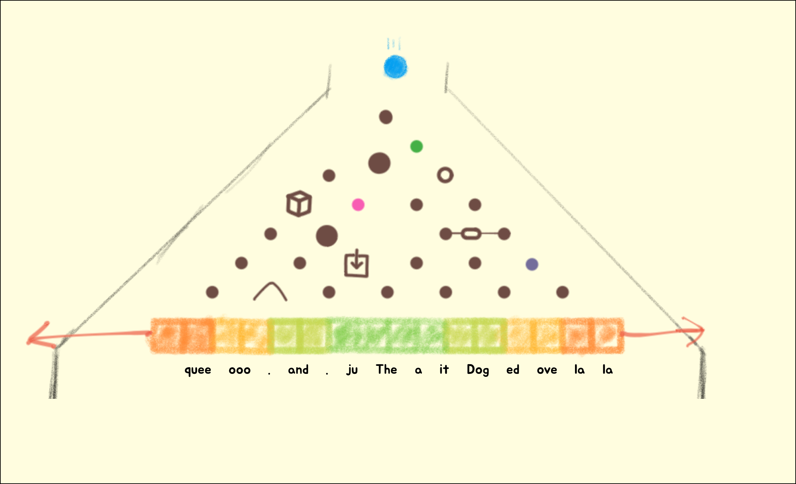

# Leveraging LLMs

## Stochastic Parrots

While LLMs appear very capable, it's important to remember they have no understanding of what they emit and cannot perform actual reasoning or logic. As a human, we're hard-wired to assign meaning to language. It's hard to fully grok that LLMs are really just predicting the most likely token in the sequence, over and over again. The fact that these tokens happen to form words and sentences is only because tokens that don't form words or sentences have low probabilities of appearing together.

## A Visual Metaphor

There's a minigame from 'The Price is Right' called Plinko. To play Plinko, a ball is dropped from the top of a tall, upright board filled with pegs. As the ball falls, it bounces off the pegs until it lands in one of several slots at the bottom, each with a different prize.

LLMs form their responses by playing consecutive rounds of "extreme" Plinko - where instead of money, the winning slot decides which characters (token) to say next. For example, here's how a poorly trained, 28 parameter (pegs) LLM would decide how to respond.

How we influence the probabilities of a model's responses, is by scaling how many parameters (pegs) and modifying each parameter (training).

To train an LLM, we can tune each of the pegs (parameters) on the board to influence the outcomes (token). Parameters are not limited to shape and size, and can vary based on input and previously generated tokens - the sky is the limit. This tuning process is how the machine "learns", and results in parameters beyond our understanding.

Using many examples and a lot of GPU time, we eventually ~~hammer the model into submission~~  determine a set of parameters (pegs) that pass all of our tests. These are a model's weights.

All it takes for this LLM Plinko Player to quote shakespear is to add more pegs (parameters). 80,000,000,000 more should do it. After a month and $20 million of training, you'll have the weights you need (200GB+) to generate sequences of probable characters for any input you want.

_While this analogy provides a relatable and accurate model of how many LLMs work, every day researchers and engineers are finding clever ways to improve this incredible feat of technology in huge ways. Omissions of key concepts like attention heads, unsupervised learning and transformers is for simplicity and relevance to how I'm recommending we leverage LLMs in this product. Comments/suggestions on making it more accurate without adding complexity are welcome._

## How to use LLMs

Armed with this perspective of how LLMs generate responses, we can create some principals to leverage LLMs more strategically in our products.

### Open Ended Inputs

Summarizing and classifying information from freeform input into known options or into a standard format are great ways to use LLMs. Because most of the desired output is part of the input, e.g. direction on format, options, and examples, the model does not need to "think outside the box".

This is huge for products that can better set defaults out of the box, infer and extract relevant details without knowing the source format, and supporting more integrations with less code.

### Fill in the blanks

Before Chat took over, LLMs exposed completion APIs that required structuring prompts as a narrative which the LLM could simply pick up where you left off. This is how most training data is structured and results in fewer 'connections' to line up, leading to more accurate results.

While Chat models drastically improve less strucutred

## How not to use LLMs

Arguably more important is a set of principals to help avoid misusing LLMs.

### Known Multi Step Processes

When possible, break apart complex flows that perform multiple steps - i.e. extracting details from a resume then evaluating those details for a role.

While convenient, uses like this will behave inconsistently and be difficult to debug. The model must predict the combined outcome of two activities which will be less refined than each activity individually.

By breaking it apart, you end up with more observable, testable and working code.

