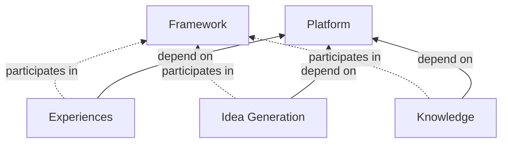

# Architecture

## Goals

- Support vision outlined in overview
- Be simple, cost effective, and understandable
- leverage LLM generated and managed code safely
- take advantage of future advances in LLM / ML quickly

## System Design

Clever will compose four primary systems: Platform, Knowledge, Idea Generation, and Experiences, which allow
for minimal
dependencies and clear interfaces, as well as a framework runtime to integrate them.

### Platform will provide

Simplify and abstract away commodity aspects like CRUD Resources, Access Controls, Accounts, and LLM routing.

- inference endpoints for models required
- authentication and identity needs
- rate limiting, cost budgeting, and limits
- payments, plans, and profiles
- Project details and storage as a service

### Framework will provide

Orchestration framework and interface definitions to
facilitate problem and idea management at runtime by all registered servies.

- a generic, pluggable workflow to generate ideas, extendable for context
    - Interfaces for services, events, discussions
    - Capabilities to manage Facts, Unknowns

### Knowledge will provide

Knowledge will ingest and maintain knowledge graphs and relavent data.

- integrations with storage providers
- extraction of entities from resources
- maintain a knowledge graph
- an idea generation service to provide context when known
- an idea generation service to recognize and store new knowledge from conversations
- an idea generation service which can search the web for relevant public knowledge

### Idea Generation

- Services for Problems, Ideas, and Communication
- Project level generation of problems, rules, evaluation criteria
- Idea generation and evaluation capabilities
    - Catalog of methodologies and mental models
- Feedback mechanisms and persistence of problems, ideas and chats

### Experiences

Users will interact
with Experiences on their device which then leverage the rest of the system. Providing,

- Web / Mobile / Apps for users
    - Signup/Projects/Link Resources/All Features available
    - Transparency into knowledge and resources
    - See generated ideas / discussions in chat form
- API for integrations with tools for in context ideas
- Many simple integrations to bring ideas to where the user is
- An idea generation service which allows the user to take part in discussions and maintains a connection to the client
