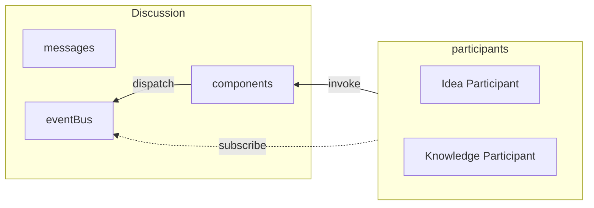

# Framework

The framework provides a central set of interfaces and interactions which enable an event centric programming model that can easily be expanded without changing core code.

## Components

Components are generic APIs that define events and resources participants can use to interact and report data others can consume.

### Fact Component

The FactAPI component stores facts created by participants as they extract details from the conversation, their own stores, etc.

### Unknown Component

The UnknownAPI stores "known unknown"s which a participant can create to define data that need to improve their solutions.

## Participants

### Conversation Participant

Responsible for generating messages containing ideas, or to ask questions should they be necessary.

### Idea Participant

Responsible for generating ideas based on the Problem and context.

### Problem Participant

Responsible for defining the problem that needs solving.

### User Interrogator

Offers questions for users which can provide missing context

